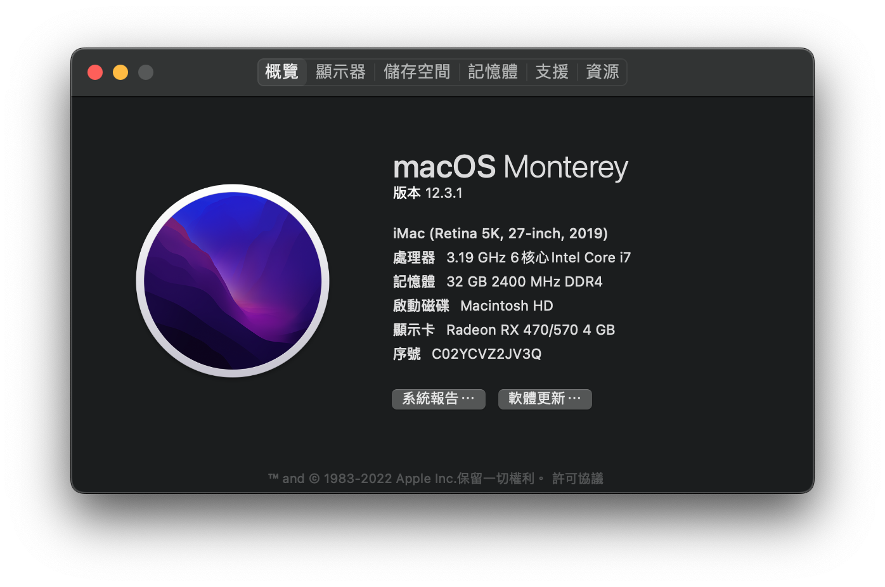

# ROG STRIX H370-F GAMING Hackintosh

## 系統版本:
- Big Sur 11.5

## 配置：
- CPU: i7-8700
- Motherboard: ROG STRIX H370-F
- Memory: G.SKILL Trident Z 16G 2400MHZ
- SSD: Intel 760P 512G
- Graphics: ROG STRIX-RX470-O4G-GAMING
- BIOS: 2701
- Clover: r5138

## 歷史版本:
- [11.0.3](https://github.com/ChengYen-Tang/ROG-STRIX-H370-F-GAMING-Hackintosh/tree/32970aeeb07466b6f9c729df0828c749db921a8e)
- [11.0.1](https://github.com/ChengYen-Tang/ROG-STRIX-H370-F-GAMING-Hackintosh/tree/e4be3b63396227f073562570a2a217fbba8a1b51)
- [10.15.x](https://github.com/ChengYen-Tang/ROG-STRIX-H370-F-GAMING-Hackintosh/tree/4a6dbf9703a9e7387d2796bfa0283a211f32d45f)
- [10.14.6](https://github.com/ChengYen-Tang/ROG-STRIX-H370-F-GAMING-Hackintosh/tree/2c2ffbc8561eb157fc95d8c7d39116bd3a8252b9)
